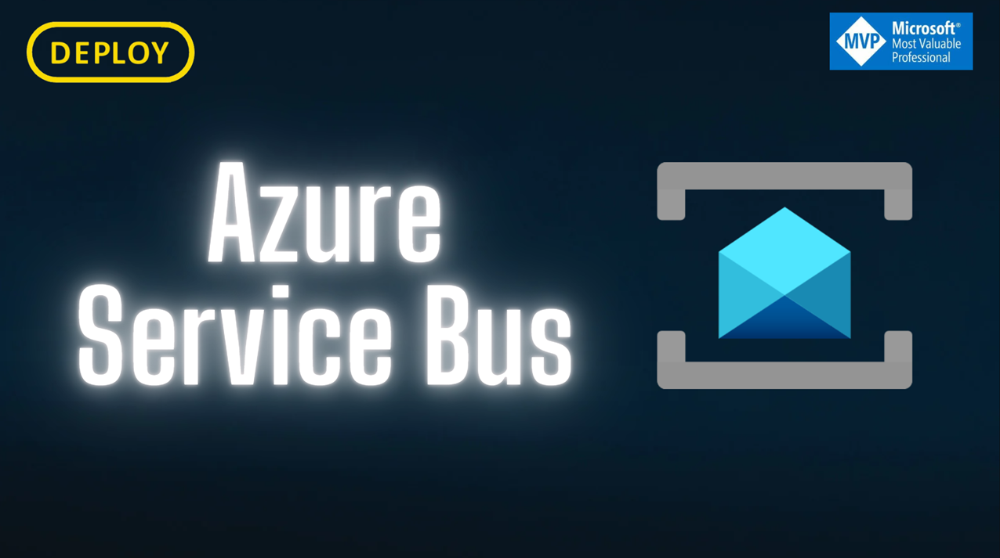

# DEPLOY.AzureServiceBus



# Vídeos no Youtube
[](https://www.youtube.com/watch?v=7Roz4nFIwTs&list=PLf7uDG4xdAJ0Tp6zTkmdInDisrvRqiYLC&ab_channel=DEPLOY)


> [!IMPORTANT]
> GitHub TAG utilizada no vídeo do YouTube
> 
> 2025.05.19


# Introdução
O projeto **DEPLOY.AzureServiceBus** é uma solução de exemplo que demonstra como usar o Azure Service Bus para comunicação entre serviços. O projeto inclui exemplos de produção e consumo de mensagens usando filas e tópicos do Azure Service Bus.

# Estrutura do projeto

- **src/**: Código fonte principal
  - **DEPLOY.AzureServiceBus.API**: API para envio de mensagens
  - **DEPLOY.AzureServiceBus.WorkerService.Consumer**: Worker para consumir mensagens
  - **DEPLOY.AzureServiceBus.Function.Consumer**: Azure Function para consumo
- **tests/**: Testes automatizados
- **docker/**: Arquivos para execução local com Docker
- **docs/**: Documentação e imagens

````
├── .github
    ├── CODEOWNERS
    ├── dependabot.yml
    ├── dependency-review.yml
    ├── secret_scanning.yml
    └── workflows
    │   ├── codeql.yml
    │   ├── pr-check.yml
    │   └── sandbox-api.yml
├── .gitignore
├── README.md
├── docker
    ├── .env
    ├── config.json
    └── infra-docker.yml
├── docs
    └── Azure-Service-Bus.pdf
├── src
    ├── DEPLOY.AzureServiceBus.API
    │   ├── .dockerignore
    │   ├── DEPLOY.AzureServiceBus.API.Test
    │   │   └── QueueTests.cs
    │   ├── DEPLOY.AzureServiceBus.API
    │   │   ├── Config
    │   │   │   └── ParametersConfig.cs
    │   │   ├── DEPLOY.AzureServiceBus.API.csproj
    │   │   ├── Dockerfile
    │   │   ├── Endpoints
    │   │   │   ├── v1
    │   │   │   │   ├── QueueEndpoint.cs
    │   │   │   │   ├── QueuePartitionEndpoint.cs
    │   │   │   │   └── QueueSessionEndpoint.cs
    │   │   │   └── v2
    │   │   │   │   ├── TopicCloudEventsEndpoint.cs
    │   │   │   │   └── TopicEndpoint.cs
    │   │   ├── Extensions
    │   │   │   ├── AzureServiceBusConfigExtension.cs
    │   │   │   ├── OpenApiConfigExtension.cs
    │   │   │   └── OptionConfigExtension.cs
    │   │   ├── Program.cs
    │   │   ├── Properties
    │   │   │   └── launchSettings.json
    │   │   ├── Util
    │   │   │   └── GenerateData.cs
    │   │   ├── _requests
    │   │   │   ├── Queue.http
    │   │   │   └── http-client.env.json
    │   │   ├── appsettings.Development.json
    │   │   └── appsettings.json
    │   ├── DEPLOY.AzureServiceBus.sln
    │   └── DEPLOY.AzureServiceBus.slnx
    ├── DEPLOY.AzureServiceBus.Function.Consumer
    │   ├── .dockerignore
    │   ├── DEPLOY.AzureServiceBus.Function.Consumer.slnx
    │   └── DEPLOY.AzureServiceBus.Function.Consumer
    │   │   ├── .gitignore
    │   │   ├── DEPLOY.AzureServiceBus.Function.Consumer.csproj
    │   │   ├── Dockerfile
    │   │   ├── Program.cs
    │   │   ├── Properties
    │   │       ├── launchSettings.json
    │   │       ├── serviceDependencies.json
    │   │       └── serviceDependencies.local.json
    │   │   ├── Queue
    │   │       ├── DLQQueueBatchConsumer.cs
    │   │       ├── DLQQueuePartitionConsumer.cs
    │   │       ├── DLQQueuePartitionSessionConsumer.cs
    │   │       ├── DLQQueueSimpleConsumer.cs
    │   │       ├── DLQQueueSimpleDuplicateConsumer.cs
    │   │       ├── DLQQueueSimpleReplyConsumer.cs
    │   │       └── DLQQueueSimpleScheduleConsumer.cs
    │   │   ├── Topic
    │   │       ├── DLQTopicConsumer_Client1.cs
    │   │       └── DLQTopicConsumer_Client2.cs
    │   │   └── host.json
    └── DEPLOY.AzureServiceBus.WorkerService.Consumer
    │   ├── DEPLOY.AzureServiceBus.WorkerService.Consumer.slnx
    │   └── DEPLOY.AzureServiceBus.WorkerService.Consumer
    │       ├── Config
    │           └── ParametersConfig.cs
    │       ├── DEPLOY.AzureServiceBus.WorkerService.Consumer.csproj
    │       ├── Domain
    │           └── Product.cs
    │       ├── Extensions
    │           ├── AzureServiceBusConfigExtension.cs
    │           └── OptionConfigExtension.cs
    │       ├── Program.cs
    │       ├── Properties
    │           └── launchSettings.json
    │       ├── Queue
    │           ├── partition
    │           │   └── Worker_Processor_Partition.cs
    │           ├── session
    │           │   └── Worker_Processor_Partition_Session.cs
    │           └── simple
    │           │   ├── Worker_Batch_Normal_005.cs
    │           │   ├── Worker_Batch_Processor_006.cs
    │           │   ├── Worker_DLQ.cs
    │           │   ├── Worker_Duplicate_002.cs
    │           │   ├── Worker_Product_001.cs
    │           │   ├── Worker_Schedule_003.cs
    │           │   └── Worker_Simple_Qtd_004.cs
    │       ├── Topic
    │           ├── WorkerCloudEvents.cs
    │           └── WorkerCloudEvents2.cs
    │       ├── WorkerTransaction.cs
    │       ├── appsettings.Development.json
    │       └── appsettings.json
└── tests
    ├── DEPLOY.AzureServiceBus.API.IntegrationTest
        ├── Config.json
        ├── DEPLOY.AzureServiceBus.API.IntegrationTest.csproj
        └── QueueIntegrationTests.cs
    └── DEPLOY.AzureServiceBus.API.Test
        ├── AzureServiceBusConfigExtensionTests.cs
        ├── DEPLOY.AzureServiceBus.API.Test.csproj
        ├── v1_Endpoints
            ├── QueuePartitionTests.cs
            ├── QueueSessionTests.cs
            └── QueueTests.cs
        └── v2_Endpoints
            └── TopicCloudEventsEndpointTest.cs
````
# Como executar

Execute os projetos individualmente:

```sh
dotnet run --project .\src\DEPLOY.AzureServiceBus.API\DEPLOY.AzureServiceBus.API\DEPLOY.AzureServiceBus.API.csproj
dotnet run --project .\src\DEPLOY.AzureServiceBus.WorkerService.Consumer\DEPLOY.AzureServiceBus.WorkerService.Consumer\DEPLOY.AzureServiceBus.WorkerService.Consumer.csproj
dotnet run --project .\src\DEPLOY.AzureServiceBus.Function.Consumer\DEPLOY.AzureServiceBus.Function.Consumer\DEPLOY.AzureServiceBus.Function.Consumer.csproj
```

Ou utilize Docker Compose para rodar tudo localmente:

```sh
docker compose -f docker/infra-docker.yml up
```

# Testes

Execute os testes com:

```sh
dotnet test
```

# Azure Service Bus Emulador

### Limitações
É claro que o Emulador do Barramento de Serviço não é um serviço real do Barramento de Serviço. Ele tem algumas limitações:

- Não pode transmitir mensagens usando o protocolo JMS.
- Entidades particionadas não são compatíveis com o Emulador.
- Ele não oferece suporte a operações de gerenciamento em tempo real por meio de um SDK do lado do cliente.
- Ele não oferece suporte a recursos de nuvem, como dimensionamento automático ou recursos de recuperação de desastres geográficos, etc.
- Ele tem um limite de 1 namespace e 50 filas/tópicos.
- Mais limitações podem ser encontradas na [Visão Geral do Emulador do Barramento de Serviço do Azure](https://learn.microsoft.com/pt-br/azure/service-bus-messaging/overview-emulator#known-limitations).

# Contribuição

Contribuições são bem-vindas! Abra uma issue ou envie um pull request.

# Licença

Este projeto está licenciado sob a licença MIT.
